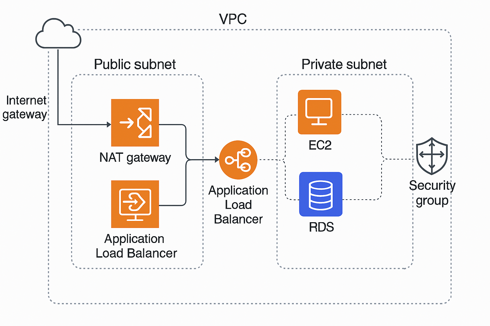

# 🚀 ShopEase LTD Cloud Migration Project

## Overview

This project involves the migration of ShopEase LTD's infrastructure to AWS. The goal is to build a **secure, scalable, and highly available** cloud-based e-commerce infrastructure.

## 🛠️ Tools & Technologies
- AWS VPC, EC2, RDS, ALB, Auto Scaling
- Terraform
- CloudWatch, CloudTrail
- Ubuntu Linux (20.04)
- IAM Roles and Policies

## 📐 Architecture

- Multi-AZ VPC with public & private subnets
- Application Load Balancer for traffic distribution
- Auto Scaling Group for application EC2 instances
- NAT Gateway for outbound internet access from private subnets
- RDS deployed in private subnet
- Monitoring with CloudWatch

## 🔐 Security Measures
- IAM user roles with least privilege access
- Security groups per layer (Load Balancer, App, DB)
- NACLs on subnets for extra protection
- Encrypted communication & backups

## 🔄 Auto Scaling & Load Balancing
- Launch Template based on custom AMI
- ASG spans multiple AZs with dynamic scaling
- Health checks via ALB
- ELB listeners for HTTP/HTTPS traffic

## 📈 Monitoring & Logging
- CloudWatch for metrics & alarms
- CloudTrail for API call history
- Logs stored in CloudWatch Logs group

## 📊 Diagram

## ✅ Deployment Guide
1. Clone repo and `cd` into directory
2. Configure AWS credentials
3. Run `terraform init`
4. Run `terraform apply`

## 👥 Team Roles
- **Architect:** VPC & architecture design
- **Engineer:** EC2, ALB, ASG setup
- **DB Admin:** RDS configuration
- **Security:** IAM, SG, ACL setup
- **Ops:** Monitoring & documentation

## 📄 Outcome
A fully functional, cloud-native, production-ready e-commerce infrastructure.

---

Gen Cloud Consult – 2025
